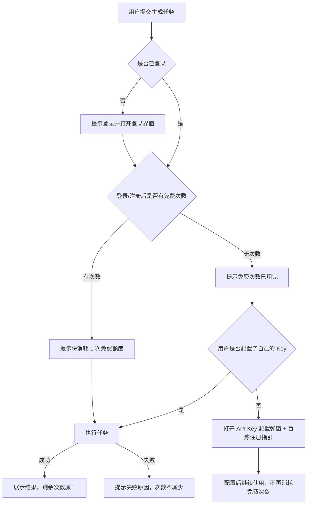
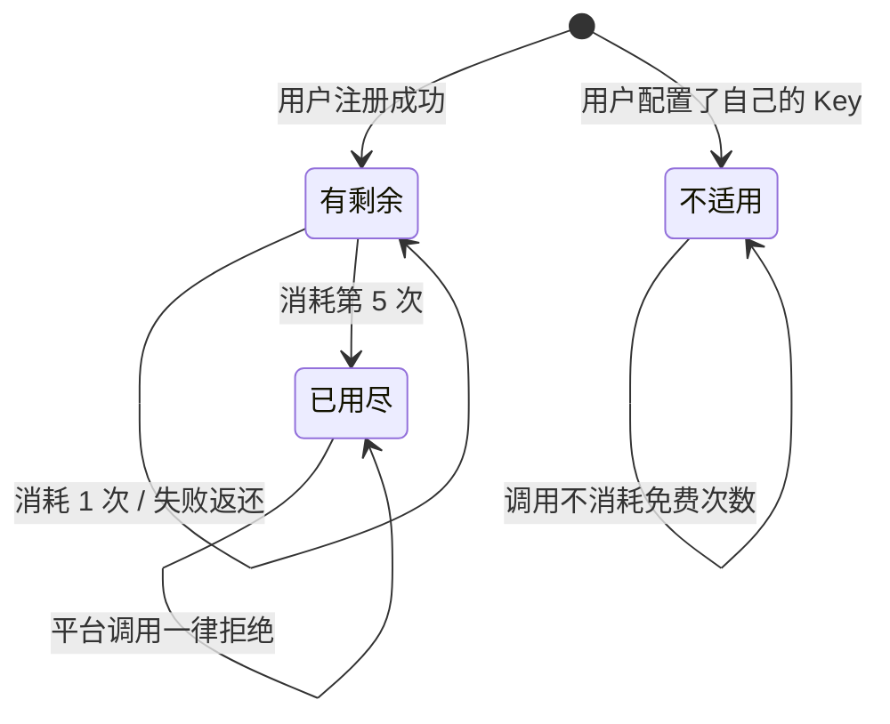
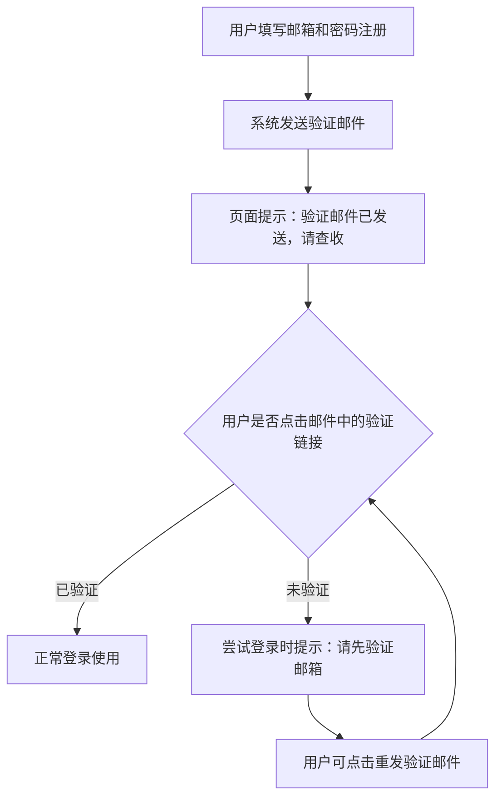

# v0.2.4 产品需求文档

**项目名称**: YouMedHub
**版本号**: v0.2.4
**创建日期**: 2026-09-19
**负责人**: koci
**状态**: 📝 待评审（评审①挂起——待确认事项见文末 Q1–Q11，下次开发启动时逐条确认）

> 本文档有两类读者：
> - **使用人**：评审需求理解是否正确、验收时逐条对照。读「功能清单 / 各需求的原始需求、需求分析、使用链路、验收标准」即可。
> - **AI / 开发者**：实现依据。技术实现（接口、字段、框架、文件路径）不在本文档 → `dev.md`；时间排期 → `plan.md`；界面设计 → `design.md`。
>
> 写作规则：**本文档不允许出现使用人无法验证的句子**。判断标准——把这句话念给没参与开发的人听，他能照着做并判断对错吗？不能，就移到 dev.md 或改写。
>
> 优先级定义见 references/priority_definitions.md

---

## 版本概述

当前使用 YouMedHub 的 AI 功能前，用户必须自己去阿里云百炼注册并配置 API Key，门槛高、流失大。本版本为每个登录用户提供 5 次免费试用，注册后无需任何配置即可完成"上传 → 分析 → 出结果"的完整体验；免费次数用完后，引导用户配置自己的百炼 API Key 继续使用。免费试用由平台统一提供 AI 调用能力，但平台的 Key 绝不出现在任何浏览器请求中。同时为防止批量注册薅免费额度，邮箱注册增加邮件验证环节。

### 成功指标

- 新用户从注册到看到第一份分析结果，全程不超过 5 分钟，且不需要离开本站去注册第三方服务。
- 版本上线后，"注册 → 完成首次分析"的转化率相比上一版本有可观测的提升。
- 免费试用人均消耗封顶 5 次，平台 Key 的月度成本可预估、可控。
- 批量注册薅额度的现象可被识别（同一 IP/邮箱域异常集中注册），未出现明显滥用。

---

## 大纲

> 每个需求一行概括，让人 30 秒看清这个版本做什么。需求较多时先读大纲再决定是否细看某段。

| 需求 | 一句话概括 | 优先级 |
|------|-----------|--------|
| R1 免费试用额度 | 每个登录用户 5 次免费 AI 生成次数，用完引导配置自己的百炼 Key | P0 |
| R2 邮箱验证注册 | 邮箱注册后需点击验证邮件才能登录，防批量注册滥用 | P0 |
| R3 平台 Key 托管 | 免费试用由平台代为调用 AI，Key 不暴露给浏览器 | P0 |

---

## 功能清单

> 本版本全部功能点的总览，从各需求分析中拆解汇总。
> 评审①时：使用人据此确认「没漏、没多」。
> 评审②（验收）时：逐项回填验收结果。

| # | 所属需求 | 功能点 | 优先级 | 验收结果 |
|---|---------|--------|--------|---------|
| 1 | R1 | 未登录用户提交任务时，引导注册/登录 | P0 | ⬜ 待验收 |
| 2 | R1 | 登录用户免费试用零配置：不输入任何 Key 即可完成上传和生成 | P0 | ⬜ 待验收 |
| 3 | R1 | 免费次数按账号计算，刷新页面、换设备登录后保持一致 | P0 | ⬜ 待验收 |
| 4 | R1 | 任务执行失败时自动返还该次免费次数 | P0 | ⬜ 待验收 |
| 5 | R1 | 界面展示当前剩余免费次数 | P1 | ⬜ 待验收 |
| 6 | R1 | 免费次数用完时提示，并提供配置自己 Key 的入口与百炼注册指引 | P0 | ⬜ 待验收 |
| 7 | R1 | 配置了自己 Key 的调用不消耗免费次数 | P0 | ⬜ 待验收 |
| 8 | R1 | 免费试用限定使用平台指定的模型 | P1 | ⬜ 待验收 |
| 9 | R2 | 邮箱注册后自动发送验证邮件 | P0 | ⬜ 待验收 |
| 10 | R2 | 未验证邮箱的用户尝试登录时被拦截并提示先验证 | P0 | ⬜ 待验收 |
| 11 | R2 | 支持重新发送验证邮件 | P0 | ⬜ 待验收 |
| 12 | R2 | GitHub 登录不受邮箱验证影响 | P0 | ⬜ 待验收 |
| 13 | R2 | 注册时的人机验证（防脚本批量注册） | P1 | ⬜ 待验收 |

---

## 需求 1：免费试用额度

### 1.1 原始需求

> 我准备接入免费试用几次的功能。预期是每个人可以免费使用 5 次，超出的就要自己去注册阿里云百炼的 api key。

### 1.2 需求分析

- **是什么**：每个登录用户拥有 5 次免费 AI 生成次数，覆盖视频拆解、从零创作、参考生成三个功能。免费次数用完后，用户配置自己的百炼 API Key 即可继续无限制使用。
- **边界**：
  - 做：按账号计数的免费次数；次数展示；用完后的引导配置流程；失败返还。
  - 不做：付费购买次数；次数定期刷新（每日/每月重置）——首版为一次性 5 次；管理后台手动调整某用户的次数。
- **关键假设**（评审时逐条确认）：
  1. 免费试用必须登录后才能使用——未登录用户提交时引导注册。匿名用户无法拥有"按人计次"的额度。
  2. "1 次"的定义 = 提交一次 AI 生成任务（视频拆解 / 从零创作 / 参考生成均算 1 次）。上传文件本身不算次数，重复分析同一视频算 2 次。
  3. 任务执行失败时自动返还次数（用户不应为失败买单）。
  4. 配置了自己 Key 的用户，其所有调用不消耗免费次数（免费次数只记录平台代为调用的部分）。
  5. 免费试用限定使用平台指定的模型（低成本模型），配置自己的 Key 后可选全部模型——用于控制平台成本。
  6. GitHub 登录的用户同样拥有 5 次免费次数，与邮箱注册用户规则一致。

### 1.3 需求目标

- 新用户注册后无需离开本站、无需任何配置，即可完成首次 AI 分析。
- 免费次数用尽的用户能顺畅理解"接下来怎么办"，并找到配置自己 Key 的入口。

### 1.4 使用链路

链路说明：
1. 未登录用户在任何功能页提交任务，都会被引导到登录/注册。
2. 已登录且有剩余次数的用户，提交即消耗 1 次；失败不扣。
3. 分支点：免费次数用尽后，唯一继续方式是配置自己的百炼 Key。

### 1.5 需求详情

**功能要求**：
1. 未登录用户在视频拆解页或脚本生成页点击提交时，弹出登录/注册引导。
2. 登录用户未配置自己的 Key 时，提交任务直接使用免费额度，无需任何输入。
3. 在配置区或结果工具栏展示当前剩余免费次数（如"免费额度 3/5"）。
4. 免费次数用尽后提交时，弹出提示说明免费次数已用完，提供两个选择：打开 API Key 配置弹窗；查看如何注册百炼并获取 Key 的指引。
5. 任务失败（AI 返回错误、上传后调用失败等）时，本次消耗的免费次数自动返还，用户看到剩余次数恢复。
6. 用户配置自己的 Key 后，所有调用改走用户自己的 Key，免费次数保持不变（已消耗的不退回）。

**异常场景**：
- 网络中断导致任务无结果：按失败处理，次数返还。
- 生成过程中用户主动取消：该次是否返还——**待确认**（建议：已开始生成后取消不返还，防止白嫖）。

### 1.6 状态流转

免费额度是有状态的对象，其状态变化如下：

| 状态 | 含义 | 什么情况下进入该状态 |
|------|------|---------------------|
| 有剩余 | 剩余次数 > 0，可继续免费使用 | 注册成功即获得 5 次 |
| 已用尽 | 剩余次数 = 0，平台调用被拒绝 | 消耗完 5 次 |
| 不适用 | 用户配置了自己的 Key，额度规则不影响其使用 | 用户在配置弹窗保存了自己的 Key |

### 1.7 验收标准

- [ ] 未登录状态下提交视频分析任务，页面提示需要登录，并打开登录界面。
- [ ] 新注册用户登录后，不输入任何 Key 直接提交任务，能正常得到分析结果。
- [ ] 界面能看到当前剩余免费次数，每成功一次数字减 1。
- [ ] 刷新页面后剩余次数显示不变；退出重新登录后依然一致。
- [ ] 连续成功 5 次后，第 6 次提交时页面提示"免费次数已用完"，并能看到配置 Key 的入口。
- [ ] 按提示配置自己的百炼 Key 后，第 6 次提交能正常使用，且免费次数显示不再变化。
- [ ] 故意提交一个必然失败的任务（如上传后断网），剩余次数不减少。
- [ ] 配置了自己 Key 的用户使用功能，剩余免费次数始终不减少。

---

## 需求 2：邮箱验证注册

### 2.1 原始需求

> 为了防止注册滥用，我也想完善注册流程，接入邮件验证链路。

### 2.2 需求分析

- **是什么**：新用户用邮箱注册后，系统发送验证邮件；用户点击邮件中的验证链接后，账号才能登录使用。目的是抬高批量注册的门槛，保护免费额度不被脚本刷取。
- **边界**：
  - 做：注册触发验证邮件；未验证账号拦截登录并提示；支持重发验证邮件。
  - 不做：手机号短信验证；一次性邮箱域名黑名单拦截（首版不做，若滥用明显再迭代）；管理后台人工审核。
- **关键假设**（评审时逐条确认）：
  1. GitHub 登录用户不受影响——其邮箱已由 GitHub 验证过。
  2. 存量用户：已注册但从未验证过邮箱的账号，在本版本上线后首次登录时会被要求先验证——需要提前知会，属于一次性影响。
  3. 人机验证（CAPTCHA）作为可选增强，优先级 P1，首版可先不做。

### 2.3 需求目标

- 批量注册的成本显著提高（需要真实邮箱 + 人工点击）。
- 正常用户的注册体验不被破坏：验证邮件及时到达，流程清晰可理解。

### 2.4 使用链路

链路说明：
1. 注册成功 ≠ 可以登录；注册后进入"等待验证"状态。
2. 分支点：只有完成邮箱验证，登录才会放行。

### 2.5 需求详情

**功能要求**：
1. 邮箱注册提交后，页面立即提示"验证邮件已发送至您的邮箱，请查收并点击验证链接"。
2. 未验证用户尝试登录时，提示"邮箱尚未验证"，并保留重发验证邮件的入口。
3. 验证邮件中的链接点击后引导回本站完成验证。
4. 重发验证邮件有频率限制（避免被当成垃圾邮件），如 60 秒内仅可重发一次。

**异常场景**：
- 验证邮件未收到：用户可通过重发入口再次获取；提示用户检查垃圾邮件箱。
- 验证链接过期：提示链接已失效，引导重新发送。

### 2.6 验收标准

- [ ] 新用户用邮箱注册后，几分钟内收到验证邮件。
- [ ] 注册后未验证时尝试登录，页面提示需要先验证邮箱，无法进入功能页。
- [ ] 点击邮件中的验证链接后，回到本站可以正常登录使用。
- [ ] 在提示页点击"重新发送"，能再次收到验证邮件；60 秒内重复点击有频率限制提示。
- [ ] 使用 GitHub 登录，全程无需邮箱验证，可直接使用。

---

## 需求 3：平台 Key 托管

### 3.1 原始需求

> 并且全局提供一个 api key（这个 key 我又不想暴露在请求中），有什么办法？方案是否可行？

### 3.2 需求分析

- **是什么**：免费试用期间，AI 调用由平台统一代为完成。平台的 API Key 只在平台自己的服务端环境中使用，浏览器（以及抓包工具）中永远看不到它。
- **边界**：
  - 做：免费试用用户的全链路调用（文件上传凭证 + AI 生成）由平台代为执行；平台 Key 对用户完全不可见。
  - 不做：向用户展示、导出或共享平台 Key 的任何形式；把平台 Key 下发给用户本地保存。
- **关键假设**（评审时逐条确认）：
  1. 平台 Key 的用量成本由平台承担，靠"每人 5 次 + 限定模型"双重封顶控制风险。
  2. 用户对平台 Key 的唯一感知是"免费试用由平台提供"，界面上不会有任何 Key 相关的输入或展示。

### 3.3 需求目标

- 免费试用用户全程无感：不知道、也看不到平台 Key 的存在。
- 即使有人刻意抓包检查，也无法从任何请求中获得平台 Key。

### 3.4 使用链路

用户视角与需求 1 相同（无感知），本需求的关键验证方式是：在免费试用全流程中打开浏览器开发者工具，检查所有网络请求，均找不到平台的 Key。

### 3.5 需求详情

**功能要求**：
1. 免费试用期间，用户上传文件、发起生成、看到流式结果的全流程体验，与配置自己 Key 的用户完全一致（包括逐步流式输出）。
2. 浏览器发出的任何请求中都不包含平台 Key；平台 Key 只存在于平台的服务端环境中。
3. 平台代为调用的服务端入口必须验证用户身份，未登录或额度用尽的请求一律拒绝。
4. 用户配置自己的 Key 后，调用不再经过平台代调用通道。

**异常场景**：
- 平台代调用通道故障时，免费试用用户看到明确的失败提示（与普通失败提示区分，说明是平台服务暂时不可用），次数已自动返还。

### 3.6 验收标准

- [ ] 免费试用完整走一遍"上传视频 → 分析出结果"，过程中打开浏览器开发者工具的网络面板，所有请求中找不到以平台 Key 内容构成的字符串。
- [ ] 免费试用用户查看页面源码和加载的脚本文件，搜索不到平台 Key。
- [ ] 免费试用的结果输出是逐步流式显示的，不是长时间空白后一次性出现。
- [ ] 配置自己 Key 的用户，其调用请求中不包含平台代调用的通道地址。

---

## 非功能需求

> 用使用人可感知的方式描述，不写纯技术指标。

### 性能要求
- 免费试用走平台代调用后，点击提交到看到第一个字的等待时间，与用户自己直连 Key 的体验相当（不应出现明显的额外卡顿）。
- 验证邮件应在注册后 5 分钟内送达。

### 兼容性要求
- 已配置自己 Key 的存量用户：升级后使用流程完全不变，无感。
- 登录、注册界面在手机浏览器上可正常完成验证流程（点击邮件链接后回到站点）。

### 安全要求
- 平台 Key 不出现在前端代码、网络请求、页面任何位置。
- 免费额度的扣减在平台服务端完成，浏览器端无法通过修改页面数据绕过额度限制。
- 未登录用户无法使用平台代调用通道。

---

## 约束与依赖

> 此处记录**业务约束**和**外部依赖**，不记录技术实现细节（技术约束放 dev.md）

- 验证邮件通过现有账号服务平台（Supabase）发送，发件人显示与平台品牌一致（可后续自定义域名发信，首版接受默认发件人）。
- 免费试用规则需在注册页/配置弹窗中以简短文案告知用户（每人 5 次、失败不扣）。
- 依赖阿里云百炼服务的可用性；百炼服务故障时免费试用整体不可用（有明确提示）。
- 免费 5 次的成本预算需产品侧确认可接受，再决定是否调整限定模型范围。

---

## 待确认事项（下次开发启动时逐条确认）

> 评审①挂起中。以下假设由 AI 在起草 PRD 时推断，**需使用人逐条拍板后才能进入技术方案阶段**（design.md / dev.md 等尚未生成）。下次开发会话开始时，请先过一遍本表，将「使用人决策」列填完。

| # | 事项 | PRD 当前建议 | 使用人决策 |
|---|------|-------------|-----------|
| Q1 | 免费试用是否必须登录 | 是——未登录提交时引导注册/登录 | |
| Q2 | "1 次"的定义 | 提交一次 AI 生成任务；上传文件不算；重复分析同一视频算 2 次 | |
| Q3 | 任务失败是否返还次数 | 返还——用户不为失败买单 | |
| Q4 | 生成中途主动取消是否返还 | 不返还——已开始生成即消耗，防白嫖 | |
| Q5 | 配置自己 Key 后是否消耗免费次数 | 不消耗；已消耗的次数不退回 | |
| Q6 | 免费试用限定的模型范围 | 锁定 flash 级低成本模型（具体清单由技术侧开发前列出供选择） | |
| Q7 | GitHub 登录用户的免费次数 | 同样 5 次，规则与邮箱注册用户一致 | |
| Q8 | GitHub OAuth 是否受邮箱验证影响 | 不受影响——邮箱已由 GitHub 验证 | |
| Q9 | 存量未验证邮箱用户的处理 | 上线后首次登录要求先验证，提前公告知会 | |
| Q10 | 注册人机验证（CAPTCHA） | 放 P1，首版不做，出现明显滥用再加 | |
| Q11 | 免费 5 次的平台成本预算 | 每人最多 5 次 × 低成本模型，预算测算后确认可接受 | |
