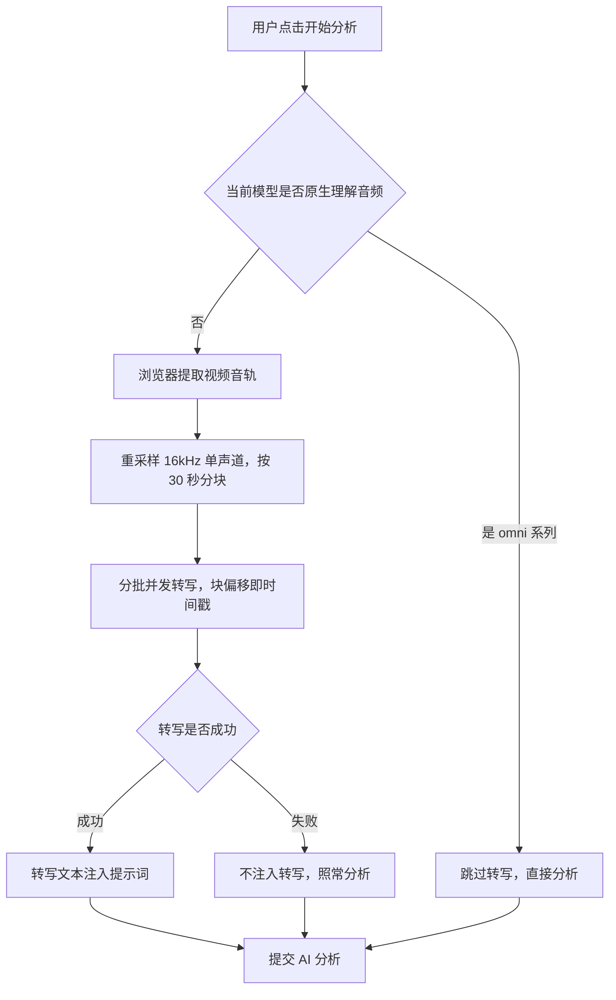
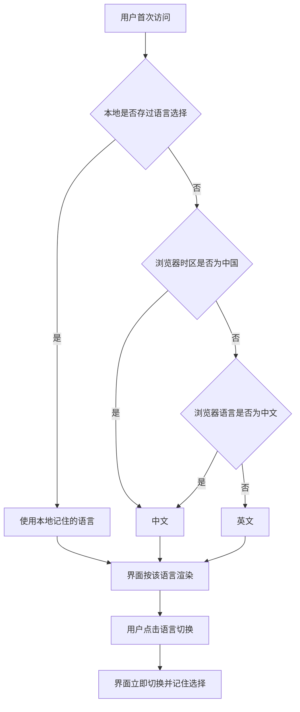

# v0.2.5 能力增强与国际化基础版

**项目名称**: YouMedHub
**版本号**: v0.2.5
**创建日期**: 2026-09-21
**负责人**: koci
**状态**: ✅ 已完成（补录归档——功能已随 2026-09-17 ~ 09-18 的提交上线，本文档为事后归档，非事前规划）

> 本文档有两类读者：
> - **使用人**：评审需求理解是否正确、验收时逐条对照。
> - **AI / 开发者**：了解这批能力的边界与实现落点。
>
> 写作规则：**本文档不允许出现使用人无法验证的句子**。

---

## 版本概述

v0.2.3 完成存储方案重构后，产品在 2026-09-17 至 09-18 之间连续上线了一批能力：修复口播台词识别不准的 ASR 前置转写、模型升级与按页面区分、中英双语界面、Google AdSense 广告接入、SEO 全量优化、AI 使用统计上报。

这些功能此前未形成版本文档，只在 `CLAUDE.md` 中零散记录。本版将其归档为一份完整的 PRD，作为后续版本（v0.2.4 免费试用、v0.3.0 媒体资料库）的基线。

本版本**不引入新的产品需求**，只固化既有能力的事实描述与验收结论。

### 成功指标

- 视频分析结果的台词列能反映视频真实口播内容，而非模型对画面的猜测。
- 非中文用户可完整使用界面，主要路径无缺失文案。
- 站点可被搜索引擎正常收录，具备社交分享卡片。
- 每次 AI 调用可追溯（谁 / 什么功能 / 哪个模型 / 什么时候）。

---

## 大纲

| 需求 | 一句话概括 | 优先级 | 状态 |
|------|-----------|--------|------|
| R1 语音转写（ASR）前置 | 非全模态模型分析视频前先转写音轨，让台词列反映真实口播 | P0 | ✅ 已上线 |
| R2 模型升级与按页面区分 | 模型升级至 qwen3.8 系列，拆解页/生成页各自独立的可选模型与默认值 | P0 | ✅ 已上线 |
| R3 中英双语界面 | 全站文案支持中文/英文切换，选择被记住 | P0 | ✅ 已上线 |
| R4 结果语言跟随界面语言 | AI 输出语言随界面语言切换，英文模式下固定英文表头 | P1 | ✅ 已上线（部分，见 v0.3.0 R5） |
| R5 Google AdSense 广告接入 | 接入广告位并补齐隐私政策页 | P1 | ✅ 已上线 |
| R6 SEO 优化 | 静态与路由级 meta、结构化数据、爬虫文件、分享图 | P1 | ✅ 已上线 |
| R7 AI 使用统计 | 每次成功调用上报一条记录，供平台侧查看用量 | P2 | ✅ 已上线 |

---

## 需求 1：语音转写（ASR）前置

### 1.1 原始需求

> 口播/台词识别不准，视频里的台词列和实际说的不一样。

### 1.2 需求分析

- **是什么**：在把视频交给 AI 分析之前，先单独提取视频音轨并转写成文字，再把转写结果作为「参考台词」注入分析提示词，要求模型以转写内容为准填写台词列。
- **为什么需要**：非全模态模型的视频输入本质是**抽帧视觉理解**，不含音频轨，模型只能根据画面猜测台词。接入 ASR 后，台词列有了真实语音依据。
- **边界**：
  - 做：浏览器端提取音轨并转写；把转写结果注入提示词；转写失败时降级为原行为。
  - 不做：说话人分离；精确到词的逐字时间戳；多语言自动识别以外的语言设置。

### 1.3 使用链路

链路说明：
1. 转写是分析的前置步骤，对用户可见为分析流程中的一个阶段提示。
2. 分支点：使用全模态模型（omni 系列）时跳过转写——该模型自带听觉能力。
3. 转写失败不阻断分析，只是退回「模型自行推断台词」的旧行为。

### 1.4 需求详情

**功能要求**：
1. 选择非全模态模型分析视频时，系统先自动提取音轨并转写，再发起分析。
2. 转写结果作为「参考台词」注入提示词，明确要求模型以此为准。
3. 转写的时间信息用于台词与镜头的对位参考。
4. 转写失败（网络、格式、时长超限等）时静默降级，不影响分析任务本身。
5. 使用全模态模型（`qwen3.8-omni-flash`）时不执行转写，避免重复耗时。

**异常场景**：
- 视频无音轨或音轨损坏：转写跳过，按无转写处理。
- 转写部分分块失败：失败块跳过，其余块照常注入（缺块不阻断整体）。
- 浏览器不支持所需音频能力：转写跳过，照常分析。

### 1.5 验收标准

- [x] 使用非全模态模型分析带口播的视频，台词列内容与视频中实际说的话一致。
- [x] 分析过程中能看到转写阶段提示，转写完成后进入正式分析。
- [x] 使用 `qwen3.8-omni-flash` 分析时，不出现转写阶段，直接进入分析。
- [x] 断网或转写服务不可用时，分析仍能继续，只是台词列退回模型推断。
- [x] 转写耗时不会让用户看到长时间无反馈的空白等待（有阶段提示）。

### 1.6 实现落点

| 位置 | 职责 |
|------|------|
| `src/api/asr.ts` | 音轨提取、重采样、分块、并发转写、时间戳生成 |
| `src/api/videoAnalysis.ts` | 调用转写并把结果注入提示词 |
| `src/prompts/videoAnalysis.ts` | 转写内容在提示词中的注入模板 |
| `src/components/AnalysisControl.vue` | 转写阶段的状态提示 |
| `src/config/models.ts` | `supportsNativeAudio()` 判断是否跳过转写 |

**关键参数**：转写模型 `qwen3-asr-flash`；分块 30 秒；采样 16kHz 单声道；并发 4 路。

---

## 需求 2：模型升级与按页面区分

### 2.1 原始需求

> 模型要升级一下，另外拆解页和生成页适合的模型不一样。

### 2.2 需求分析

- **是什么**：可选模型从 qwen3.5 系列升级到 qwen3.8 系列，并按页面拆分可选列表与默认值——视频拆解页与脚本生成页面向不同任务，模型诉求不同。
- **边界**：
  - 做：模型列表升级；按页面区分可选模型与默认模型；面板挂载时自动校正不匹配的选中模型。
  - 不做：用户自定义模型 ID；按模型计费展示。

### 2.3 需求详情

**功能要求**：
1. 视频拆解页可选模型为 `qwen3.8-omni-flash`（默认）与 `qwen3.8-flash`。
2. 脚本生成页可选模型为 `qwen3.8-max`（默认）与 `qwen3.8-flash`。
3. 用户进入某页面时，若全局选中的模型不在本页列表内，自动切换为本页默认模型。
4. 模型下拉只展示本页可用的模型，不出现跨页模型。
5. 纯文本模型（`qwen3.7-max`）不出现在任何可选列表中。

**异常场景**：
- 模型配置中引用了不存在的模型 ID：该模型被静默过滤，不出现空选项。

### 2.4 验收标准

- [x] 打开视频拆解页，模型下拉只有两个选项，默认选中 `qwen3.8-omni-flash`。
- [x] 打开脚本生成页，模型下拉只有两个选项，默认选中 `qwen3.8-max`。
- [x] 在拆解页选了 `qwen3.8-flash` 后切到生成页，模型自动变为该页的默认值而非残留。
- [x] 任一页面的模型下拉中都不出现 `qwen3.7-max`。

### 2.5 实现落点

| 位置 | 职责 |
|------|------|
| `src/config/models.ts` | 模型清单、按页面的可选 ID 列表与默认 ID |
| `src/composables/useModelSelect.ts` | 三面板共用的模型选择 + 切换重传提示 |
| `src/components/AnalysisControl.vue` | 拆解页模型选择 |
| `src/components/CreateModePanel.vue` | 生成页模型选择 |

---

## 需求 3：中英双语界面

### 3.1 原始需求

> 还有要支持多语言。

### 3.2 需求分析

- **是什么**：界面文案支持简体中文与 English 两种语言，用户可随时切换，选择被记住。
- **边界**：
  - 做：菜单、页面、表单、上传提示、错误提示、空状态、登录与收藏相关文案的双语；语言选择持久化；初始语言自动检测。
  - 不做：繁体中文；第三种语言；按用户账号同步语言偏好（首版仅本地记住）。

### 3.3 使用链路

链路说明：
1. 首次访问时按「本地选择 > 中国时区 > 浏览器语言 > 英文」的顺序决定初始语言。
2. 用户手动切换后，选择优先于任何自动检测。

### 3.4 需求详情

**功能要求**：
1. 左侧菜单栏提供语言切换入口，展示当前语言。
2. 切换后菜单、页面、表单、提示、错误信息、空状态立即使用目标语言。
3. 用户的语言选择在刷新页面、关闭浏览器后再次访问时保持。
4. 翻译缺失时回退到中文，不出现空白或键名。
5. 页面标题与搜索描述随语言切换同步更新。
6. 浏览器标签的 `lang` 属性随语言切换（影响屏幕阅读器与拼写检查）。

**异常场景**：
- 浏览器禁用本地存储：语言切换在当前会话内仍生效，只是不被记住。
- 语言检测接口不可用：回退到英文。

### 3.5 验收标准

- [x] 切换为 English 后刷新页面，菜单与主要操作仍为 English。
- [x] 在 English 界面下上传不支持的文件，错误提示为 English。
- [x] 在 English 界面下切换路由，页面标题为 English。
- [x] 某条翻译缺失时，页面显示中文文案，不出现键名或空白。
- [x] 首次访问时，中国时区的用户默认看到中文界面。

### 3.6 实现落点

| 位置 | 职责 |
|------|------|
| `src/composables/useLocale.ts` | 语言状态、初始检测、`t()` 插值、持久化 |
| `src/locales/zh.ts` / `en.ts` | 中英文字典（英文字典受 `typeof zh` 约束，漏键编译报错） |
| `src/components/LanguageSwitcher.vue` | 切换控件 |
| `src/components/layout/AppMenu.vue` | 切换入口挂载位置（左侧菜单栏） |

---

## 需求 4：结果语言跟随界面语言

### 4.1 原始需求

> 生成的结果也要支持多语言。

### 4.2 需求分析

- **是什么**：AI 生成的内容语言跟随界面语言——中文界面产出中文结果，英文界面产出英文结果。
- **边界**：
  - 做：分析/创作/参考三种模式的输出语言跟随界面语言；英文模式下固定英文表头以便稳定解析。
  - 不做：**结果语言与界面语言解耦**（独立的「结果语言」选择器）——这是 v0.3.0 R5 的范围。
  - 不做：同一结果的多个语言版本保存与切换——v0.3.0 R6。

### 4.3 需求详情

**功能要求**：
1. 界面为中文时，AI 输出的分镜字段、说明文字为中文。
2. 界面为英文时，AI 输出的分镜字段、说明文字为英文。
3. 英文输出使用固定英文表头，表格解析器同时兼容中英文表头。
4. 生成结果后切换界面语言，**已生成的内容不被改写**。

**异常场景**：
- 模型未遵循语言指令：表格解析器仍能通过中英文表头兼容定位，不出现解析失败。

### 4.4 验收标准

- [x] 中文界面下分析视频，分镜表格内容为中文。
- [x] 英文界面下分析视频，分镜表格内容为英文且表头为英文。
- [x] 英文界面下生成的结果，切换回中文界面后，已生成内容仍为英文。
- [x] 中英文表头的结果都能正确解析为分镜表格。

### 4.5 实现落点

| 位置 | 职责 |
|------|------|
| `src/prompts/videoAnalysis.ts` | `OutputLocale` 类型、英文输出指令、中英文表头兼容 |
| `src/api/videoAnalysis.ts` | 分析/生成接口的 `locale` 参数 |
| `src/components/AnalysisControl.vue` | 拆解页传入当前界面语言 |
| `src/components/CreateModePanel.vue` / `ReferenceModePanel.vue` | 生成页传入当前界面语言 |

> **与 v0.3.0 的关系**：本需求实现了「结果语言 = 界面语言」。v0.3.0 R5 要求把两者解耦，提供独立的结果语言选择器；R6 要求支持同一结果的多个语言版本。届时本需求的实现（`locale` 参数链路）可复用，需新增的是独立选择项与版本存储。

---

## 需求 5：Google AdSense 广告接入

### 5.1 原始需求

> 接入广告，增加一点收入。

### 5.2 需求分析

- **是什么**：在站点中接入 Google AdSense 广告位，并补齐 AdSense 审核必需的隐私政策页。
- **边界**：
  - 做：广告位组件、广告脚本接入、隐私政策页、授权文件。
  - 不做：其他广告平台；广告频次/展示策略的个性化配置。

### 5.3 需求详情

**功能要求**：
1. 首页底部与结果区底部展示广告位，避开用户操作区域。
2. 未配置广告单元 ID 时，广告位完全不渲染（不影响布局）。
3. 广告加载失败时静默隐藏，不显示错误占位。
4. 提供隐私政策页，说明 Cookie 与个性化广告的使用方式，中英双语。
5. 提供站点授权文件，声明广告发布商身份。

**异常场景**：
- 广告被浏览器插件拦截：广告位隐藏，页面其余部分正常。
- 广告单元 ID 未配置：不加载广告脚本，不渲染任何广告位。

### 5.4 验收标准

- [x] 首页底部与结果区底部能看到广告位（已配置广告单元 ID 时）。
- [x] 未配置广告单元 ID 时，页面中不存在广告位占位与空白间隙。
- [x] 访问 `/privacy` 能看到隐私政策页，切换语言后内容为对应语言。
- [x] 广告被拦截时，页面功能不受影响。

### 5.5 实现落点

| 位置 | 职责 |
|------|------|
| `src/lib/adsense.ts` | 发布商 ID 读取与启用判断 |
| `src/components/AdSlot.vue` | 广告位组件（挂载时渲染，路由切换自动刷新） |
| `index.html` | 广告脚本引入（审核要求源码可见） |
| `src/views/PrivacyPage.vue` | 隐私政策页 |
| `public/ads.txt` | 发布商授权文件 |

> **注意**：发布商 ID 存在三处（`index.html`、`public/ads.txt`、`src/lib/adsense.ts` 回退值），更换账号需同步修改。

---

## 需求 6：SEO 优化

### 6.1 原始需求

> 希望搜索引擎能搜到。

### 6.2 需求分析

- **是什么**：完善站点的搜索引擎元信息、结构化数据、爬虫指引与社交分享卡片。
- **边界**：
  - 做：静态 meta、路由级动态 meta、结构化数据、爬虫文件、分享图。
  - 不做：预渲染 / SSR（当前为 SPA，社交爬虫只能看到静态 meta，后续如需提升可考虑预渲染或框架迁移）。

### 6.3 需求详情

**功能要求**：
1. 首页具备标题、描述、关键词等基础 meta。
2. 具备 Open Graph 与 Twitter Card 分享卡片信息，含 1200×630 分享图。
3. 具备结构化数据，声明站点为 Web 应用。
4. 每个公开路由具备独立的页面标题与描述，且随语言切换更新。
5. 提供爬虫指引文件，屏蔽个人中心与收藏页，并声明站点地图。
6. 提供站点地图，包含全部公开路由。
7. 全站统一正式域名。

**异常场景**：
- 路由未配置描述：回退到首页描述，不出现空 meta。
- 直达带 `index.html` 的路径：规范化为根路径。

### 6.4 验收标准

- [x] 查看首页源码，能看到标题、描述、OG、Twitter Card 与结构化数据。
- [x] 切换路由后，浏览器标签标题与页面描述随路由变化。
- [x] 切换语言后，标签标题与描述变为对应语言。
- [x] 访问爬虫指引文件，能看到对个人中心与收藏页的屏蔽规则及站点地图地址。
- [x] 访问站点地图，能看到 4 个公开路由且域名为正式域名。

### 6.5 实现落点

| 位置 | 职责 |
|------|------|
| `index.html` | 静态 meta、OG、Twitter Card、结构化数据、广告脚本 |
| `src/router/index.ts` | 路由级动态 meta 与规范链接刷新 |
| `src/config/site.ts` | 站点地址单点来源 |
| `public/robots.txt` / `sitemap.xml` / `og-image.png` | 爬虫与分享资源 |

> **注意**：正式域名硬编码在四处（`index.html`、`src/router/index.ts`、`robots.txt`、`sitemap.xml`），更换域名需同步修改。

---

## 需求 7：AI 使用统计

### 7.1 原始需求

> 想知道每天有多少人在用、用的是什么功能。

### 7.2 需求分析

- **是什么**：每次 AI 调用成功后上报一条记录（谁、什么功能、哪个模型、什么时候），供平台侧查看用量。
- **边界**：
  - 做：成功后上报；按功能与模型分类；数据仅平台侧可见。
  - 不做：面向用户的用量报表；调用耗时、Token 消耗的统计（Token 信息已在结果工具栏展示，但不入库）。

### 7.3 需求详情

**功能要求**：
1. 视频拆解、从零创作、参考生成三种功能调用成功后各上报一条记录。
2. 记录包含用户、功能、模型与时间。
3. 上报失败静默降级，不影响用户拿到结果。
4. 上报数据不开放给前端读取，仅平台侧可查看。
5. 用户被删除时保留其历史记录（统计不因账号注销而丢失）。

**异常场景**：
- 上报请求失败：用户无感知，结果正常展示。
- 未登录用户调用：不产生上报记录。

### 7.4 验收标准

- [x] 完成一次视频分析后，平台侧能查到一条 `analyze` 功能的记录。
- [x] 完成一次脚本生成后，平台侧能查到对应 `create` / `reference` 功能的记录。
- [x] 断开上报通道时，用户仍能正常拿到分析结果。
- [x] 前端无法读取到统计表中的数据。

### 7.5 实现落点

| 位置 | 职责 |
|------|------|
| `src/api/usageLog.ts` | 上报入口 `logUsage(feature, modelId)` |
| `supabase/migrations/20260918_usage_logs.sql` | 表结构、索引与行级安全策略 |
| `src/components/AnalysisControl.vue` / `LeftPanel.vue` | 调用成功后触发上报 |

> **部署注意**：迁移脚本需在 Supabase SQL Editor 手动执行。

---

## 非功能需求

### 性能
- 转写为分析流程增加了前置耗时，需有阶段提示避免用户误判为卡死。
- 语言切换为即时生效，无需刷新页面。
- 广告脚本为异步加载，不阻塞页面渲染。

### 兼容性
- 浏览器禁用本地存储时，应用仍可正常启动与使用。
- 音频处理能力不可用时，视频分析降级运行。

### 安全
- 使用统计数据对前端只开放写入，不开放读取。
- 广告发布商 ID 与站点域名保持一致，避免授权校验失败。

---

## 约束与依赖

- ASR 依赖阿里百炼 `qwen3-asr-flash` 服务的可用性；不可用时分析降级运行。
- 广告展示依赖 Google AdSense 的账号状态与审核结果。
- 统计依赖 Supabase 数据库，迁移脚本需手动执行。

---

## 已知遗留

以下问题在本版本上线时已知，记录备查：

1. **结果语言与界面语言未解耦**：当前结果语言完全跟随界面语言，用户无法在中文界面下产出英文结果。→ 交由 v0.3.0 R5 解决。
2. **转写时间戳粒度为 30 秒**：转写模型不输出原生时间戳，以分块偏移代替，镜头对位精度有限。
3. **语言偏好未跨设备同步**：语言选择只存在本地，换设备后回到自动检测结果。
4. **`CLAUDE.md` 中部分描述已过时**：语言切换位置、模型配置描述的更新随本版归档一并修正。

---

## 更新日志

- **2026-09-21**：创建本文档，归档 2026-09-17 ~ 09-18 已上线但未记录的能力。
