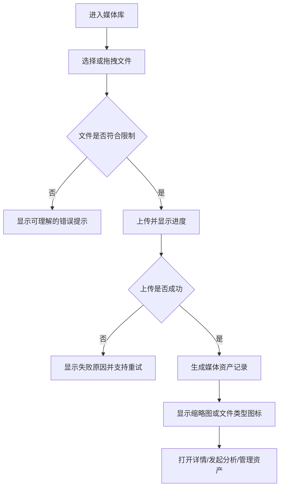
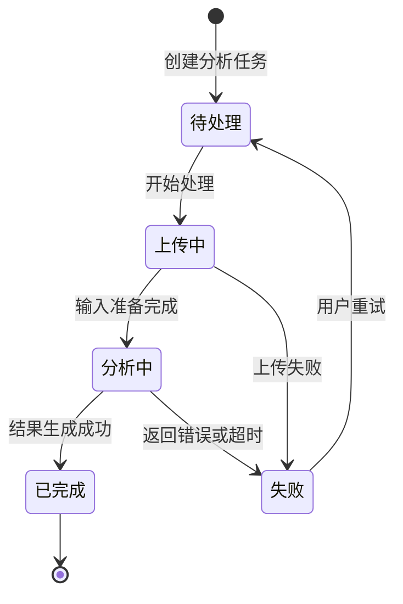

# v0.3.0 媒体资料库与多语言基础版

## 版本概述

YouMedHub 的产品定位是 **You Media Hub：媒体资料管理平台**。当前版本已经具备视频分析、脚本生成、分镜展示、Excel 导出、账号和收藏能力，但媒体文件仍以一次性分析输入为主，分析结果也主要停留在当前页面。

本版本把产品从“AI 视频分镜工具”推进为“可持续管理媒体资料、并能用多语言生成和查看内容的媒体工作台”。本版本优先建立媒体资产、分析任务和语言能力的基础闭环，为后续分镜图生成、视频生成和团队协作提供统一基础。

> **实现进度说明（2026-09-21 补注）**：本 PRD 起草后，部分需求已随 v0.2.5 提前落地。当前进度：
> - **R4 界面多语言**：✅ **已完整上线**（见 `../v0.2.5/prd.md` 需求 3），本版本无需重复实现。
> - **R5 生成结果多语言**：🔄 **部分上线**（见 `../v0.2.5/prd.md` 需求 4）——已实现“结果语言跟随界面语言”与中英文表头兼容；**尚未实现**独立的结果语言选择器、默认结果语言设置。
> - **R1 / R2 / R3 / R6**：⬜ 未开始。
>
> 本版本评审时，请以“剩余范围”为准：R1 媒体资产库、R2 媒体资产组织、R3 分析任务与结果留存、R5 的独立结果语言选择、R6 结果复用与导出。

## 原始需求

### 用户原话 1：项目定位

> youmedhub 的意思是 you media hub。你的媒体资料管理平台。

### 用户原话 2：多语言

> 还有要支持多语言。包括生成的结果也要支持多语言。

## 版本范围大纲

| 需求 | 解决的问题 | 核心做法 | 优先级 |
|---|---|---|---|
| R1 媒体资产库 | 文件只能临时上传和分析，无法持续管理 | 建立统一媒体资产入口、列表、详情和基础管理 | P0 |
| R2 媒体资产组织 | 资料数量增长后难以查找和复用 | 支持项目/文件夹、标签、搜索、收藏和筛选 | P0 |
| R3 分析任务与结果留存 | 刷新页面后分析结果丢失，无法追踪历史 | 保存任务状态、输入资产和分析结果 | P0 |
| R4 界面多语言 | 中文界面无法服务不同语言用户 | 支持中文和英文界面切换，并记住用户选择 | P0 |
| R5 生成结果多语言 | 结果语言被界面语言和提示词隐式决定 | 单独选择生成语言，支持结果翻译和语言切换 | P0 |
| R6 结果复用与导出 | 不同语言结果无法独立保存和导出 | 保存语言版本，支持查看、切换和导出指定语言 | P1 |

## 产品目标

### 目标用户

- 短视频创作者：保存素材，分析视频，生成可执行的分镜脚本。
- 内容运营人员：整理竞品和自有媒体资料，按项目、标签和语言复用内容。
- 编导和视频团队：围绕同一批媒体资产管理分析结果和脚本版本。

### 本版本目标

1. 用户可以把视频、图片、音频和文档作为媒体资料长期保存和查找。
2. 用户可以从媒体资料发起分析，并在之后查看任务和结果。
3. 用户可以分别选择界面语言和 AI 生成结果语言。
4. 用户可以为同一份结果保存多个语言版本，并查看或导出指定版本。
5. 用户的资产、任务和脚本之间有清晰的关联关系。

### 非目标

- 本版本不实现多人实时协作和评论。
- 本版本不实现 AI 分镜图生成和 AI 视频生成。
- 本版本不要求一次性迁移所有历史临时文件；历史结果应尽量保留，迁移策略另行制定。

## 需求详情

### R1 媒体资产库

#### 需求分析

系统需要提供一个媒体资料入口，用户可以上传和查看自己的媒体资产。资产至少支持视频、图片、音频和文档四类。用户选择文件后，系统应显示上传进度、文件名称、类型、大小、上传时间和处理状态。上传完成后，用户可以打开资产详情并执行后续分析或管理操作。

#### 使用链路

#### 功能要求

- 支持上传视频、图片、音频和文档。
- 资产列表展示名称、类型、大小、更新时间、所属项目和标签。
- 视频和图片展示可用的缩略图；其他类型展示明确的类型图标。
- 支持打开资产详情，查看预览、基本信息和关联内容。
- 支持删除资产。删除前必须明确提示影响范围。
- 上传失败时保留失败状态，并支持重新上传。
- 对文件类型、文件大小和无法预览的文件给出清晰提示。

#### 验收标准

- 用户上传一个支持的视频文件后，媒体库出现一条记录，并显示名称、类型、大小和上传状态。
- 用户上传图片后可以在列表中看到缩略图，并可以打开大图预览。
- 用户打开视频资产详情后可以播放视频，并能看到关联的分析任务和脚本。
- 用户上传不支持的文件时，页面说明原因，且不会生成错误的资产记录。
- 上传中刷新或网络失败时，用户可以看到失败状态并重新尝试。
- 用户删除资产并确认后，该资产从媒体库中消失，关联内容的处理方式符合页面提示。

### R2 媒体资产组织

#### 需求分析

媒体资料需要按项目和标签组织。用户应能通过搜索和筛选快速找到资产，并能够收藏常用资料。项目是管理资产的主要工作空间，标签用于跨项目检索。

#### 功能要求

- 支持创建、重命名和删除项目。
- 支持将资产归入项目，也支持将资产从项目中移出。
- 支持为资产添加、删除标签。
- 支持按名称搜索资产。
- 支持按类型、项目、标签、上传时间和收藏状态筛选。
- 支持收藏和取消收藏资产。
- 空列表、无搜索结果和无筛选结果都应提供下一步操作提示。

#### 验收标准

- 用户创建项目后，可以把已有资产归入该项目并在项目中查看。
- 用户给资产添加标签后，可以通过该标签筛选出对应资产。
- 用户输入资产名称的一部分后，列表只显示匹配结果。
- 用户组合“项目 + 类型 + 标签”筛选时，结果同时满足所有条件。
- 用户收藏资产后，可以在收藏筛选中找到它；取消收藏后不再出现。

### R3 分析任务与结果留存

#### 需求分析

当前分析结果主要存于页面内存，刷新后无法恢复。本版本需要让分析成为可追踪的任务：用户可以从资产详情发起分析，看到任务状态，在任务结束后查看结构化结果，并在之后再次打开。

#### 任务状态

#### 功能要求

- 支持从媒体资产详情发起视频分析、图片分析或脚本生成。
- 每个任务显示来源资产、创建时间、当前状态和失败原因。
- 分析过程中显示进度或阶段提示，并允许用户取消尚未完成的任务。
- 完成后保存原始结果、结构化分镜结果、模型信息和结果语言。
- 用户重新进入项目或刷新页面后，可以打开已完成结果。
- 失败任务可以重试，重试应生成新的执行记录或保留可追踪的重试次数。
- 同一资产可以有多个分析任务和多个脚本版本。

#### 验收标准

- 用户从视频资产详情点击分析后，可以看到一条“待处理/分析中”的任务记录。
- 分析完成后，用户离开页面再回来，仍能打开同一份 Markdown 和分镜表格结果。
- 分析失败时，任务记录显示失败原因，用户点击重试后可以重新执行。
- 用户取消未完成任务后，任务状态变为已取消，系统不再继续更新结果。
- 同一视频执行两次分析后，两次任务和结果可以分别查看。

### R4 界面多语言

> **状态：✅ 已上线（v0.2.5 实现）**。以下需求与验收标准已全部满足，实现落点见 `../v0.2.5/prd.md` 需求 3。本版本不再重复实现，保留原文以便追溯需求来源。
> 未覆盖项：语言偏好仅存本地，未按账号同步（见 v0.2.5「已知遗留」第 3 条）。

#### 需求分析

界面语言和内容语言是两个不同设置。界面语言影响菜单、按钮、表单、提示和错误信息；它不应自动覆盖用户已经生成的内容语言。

#### 功能要求

- 首期支持简体中文和 English。
- 支持在设置或用户菜单中切换界面语言。
- 切换后，菜单、主要页面、表单、上传提示、错误提示、空状态、登录和收藏相关文案都使用目标语言。
- 用户的界面语言选择在刷新和再次登录后保持。
- 未翻译内容不得显示空白；应使用默认语言作为回退。
- 日期、时间、文件大小和数字展示应符合当前界面语言的习惯。

#### 验收标准

- 用户把界面切换为 English 后，刷新页面，菜单和主要操作仍显示 English。
- 用户在 English 界面上传不支持的文件时，错误提示为 English。
- 用户切换界面语言后，已经生成的中文脚本内容不被自动改写。
- 用户切换回简体中文后，页面文案恢复为简体中文。
- 某个翻译项缺失时，页面显示默认语言文案，不出现 key 名称或空白。

### R5 生成结果多语言

> **状态：🔄 部分上线（v0.2.5 实现）**。已实现：结果语言跟随界面语言、中英文表头兼容解析（见 `../v0.2.5/prd.md` 需求 4）。
> **尚未实现（本版本剩余范围）**：
> - 独立的“结果语言”选择项，与界面语言解耦（需求第 1、4 条）；
> - 设置中的“默认结果语言”配置（需求第 3 条）；
> - 结果页面显示当前结果语言（需求第 6 条）。
> 验收标准中第 1、2 条（界面语言与结果语言不同）当前无法通过，其余已满足。

#### 需求分析

用户需要单独指定 AI 输出语言。生成语言不应由界面语言隐式决定。视频分析、脚本创作和参考脚本生成都应使用统一的结果语言选项，并要求表头、字段内容、说明文字保持一致。

#### 功能要求

- 在分析和生成配置中增加“结果语言”选择。
- 首期支持简体中文和 English。
- 默认结果语言可由用户在设置中配置；首次使用时提供明确默认值。
- 语言参数适用于视频分析、脚本生成和参考脚本生成。
- 选择 English 时，分镜字段内容、脚本说明和导出表头都使用 English。
- 结果页面显示当前结果语言。
- 生成失败时，错误信息使用界面语言；生成内容使用结果语言。

#### 验收标准

- 用户使用中文界面并选择 English 结果语言后，生成的分镜表格内容和字段均为 English。
- 用户使用 English 界面并选择简体中文结果语言后，生成内容为简体中文，界面仍为 English。
- 用户未主动修改结果语言时，系统使用设置中的默认结果语言。
- 用户在同一页面连续生成不同结果语言的脚本时，两次结果的语言互不影响。

### R6 结果复用与导出

#### 需求分析

同一份媒体分析可能需要服务不同语言的团队。系统应保存各语言版本，而不是覆盖原结果。用户可以在结果页切换语言、翻译已有结果，并导出当前选定语言。

#### 功能要求

- 原始结果作为一个不可丢失的语言版本保存。
- 支持基于已有结果生成另一种语言版本。
- 语言版本之间共享同一任务或脚本的来源关系。
- 结果页支持切换语言版本，并显示版本语言和生成时间。
- Excel 导出使用当前选中的语言版本。
- 用户删除翻译版本时，不删除原始结果。

#### 验收标准

- 用户对中文分析结果执行“生成 English 版本”后，可以在语言切换器中看到中文和 English 两个版本。
- 用户切换语言版本后，分镜表格、Markdown 内容和导出文件内容同步切换。
- 用户导出 English 版本后，Excel 的字段名和内容均为 English。
- 用户删除 English 翻译版本后，中文原始版本仍可正常查看。

## 版本级功能清单

| 功能点 | 优先级 | 验收状态 |
|---|---:|---|
| 媒体库列表和资产详情 | P0 | ⬜ |
| 视频、图片、音频、文档上传 | P0 | ⬜ |
| 缩略图、预览和文件信息 | P0 | ⬜ |
| 项目/文件夹管理 | P0 | ⬜ |
| 标签、搜索和组合筛选 | P0 | ⬜ |
| 资产收藏 | P1 | ⬜ |
| 分析任务创建、状态和重试 | P0 | ⬜ |
| 分析结果持久化 | P0 | ⬜ |
| 分析任务历史 | P0 | ⬜ |
| 中文/English 界面切换 | P0 | ✅ v0.2.5 已上线 |
| 界面语言持久化 | P0 | ✅ v0.2.5 已上线（仅本地） |
| 结果语言选择 | P0 | 🔄 v0.2.5 部分（跟随界面语言，缺独立选择器） |
| 多语言结果版本 | P0 | ⬜ |
| 已有结果翻译 | P1 | ⬜ |
| 指定语言查看和 Excel 导出 | P1 | ⬜ |

## 关键业务规则

1. 界面语言和结果语言相互独立。
2. 原始结果语言版本不得因为翻译或切换语言而被覆盖。
3. 资产删除、任务删除和结果删除必须明确区分，并在操作前说明影响范围。
4. 临时分析文件过期不应导致已经保存的资产记录和分析结果消失。
5. 任务失败必须可解释、可重试；用户不能只能通过刷新页面恢复。
6. 一个媒体资产可以关联多个分析任务；一个分析任务可以产生多个语言结果版本。

## 主要页面与入口

| 页面/入口 | 本版本职责 |
|---|---|
| 首页 | 展示媒体库入口、最近资产和最近任务 |
| 媒体库 | 浏览、搜索、筛选、上传和管理资产 |
| 资产详情 | 预览资产、查看元数据、发起分析、查看关联结果 |
| 分析任务 | 查看任务状态、失败原因、重试和打开结果 |
| 结果工作台 | 查看 Markdown、分镜表格、语言版本和导出 |
| 设置 | 设置界面语言、默认结果语言和其他个人偏好 |
| 收藏 | 查看收藏的资产和脚本 |

## 端到端验收场景

### 场景 A：媒体资料管理

1. 用户进入媒体库并上传一个视频。
2. 系统显示上传进度并创建资产记录。
3. 用户为视频添加项目和标签。
4. 用户通过项目和标签筛选找到视频。
5. 用户打开详情并播放视频。

预期：整个过程不需要重新上传文件，资产信息和组织关系可在刷新后恢复。

### 场景 B：分析任务留存

1. 用户从视频详情发起分析。
2. 系统显示任务状态和阶段提示。
3. 分析完成后显示分镜表格。
4. 用户刷新页面并重新进入该视频。
5. 用户从关联任务中重新打开结果并导出 Excel。

预期：任务和结果仍然存在，导出内容与上次查看的结果一致。

### 场景 C：双语言生成和切换

1. 用户将界面语言设置为 English。
2. 用户将结果语言设置为简体中文。
3. 用户上传视频并完成分析。
4. 页面操作和提示为 English，分镜结果为简体中文。
5. 用户为同一结果生成 English 版本。
6. 用户切换到 English 结果并导出 Excel。

预期：界面、结果语言和导出语言分别符合选择，原始中文结果仍可切换回来。

## 成功指标

- 新用户可以在 3 分钟内完成“上传资产 → 发起分析 → 查看结果”的首次闭环。
- 已上传资产可以通过项目、标签或名称搜索被再次找到。
- 已完成任务刷新后仍可恢复，恢复成功率达到 100%。
- 中文和 English 界面主要路径无缺失文案。
- 用户可以在不重复分析视频的情况下获得另一种语言的结果。

## 版本边界与后续方向

本版本完成资产和多语言基础闭环后，后续版本再扩展：

- v0.4.0：分镜图生成、图片版本管理、视频片段生成。
- v0.5.0：团队空间、成员权限、评论、版本历史和协作审核。
- 后续：更多语言、批量翻译、术语表、团队级语言偏好和内容审核。

## 待确认事项

- 首期长期媒体存储服务由产品和技术共同确定。
- 支持的最大文件大小和各媒体类型的格式范围需要在技术方案阶段冻结。
- 翻译结果是否计入独立的 AI 使用额度，需要在商业规则中确认。
- 历史收藏脚本是否自动补齐语言元数据，需要在迁移方案中确认。
